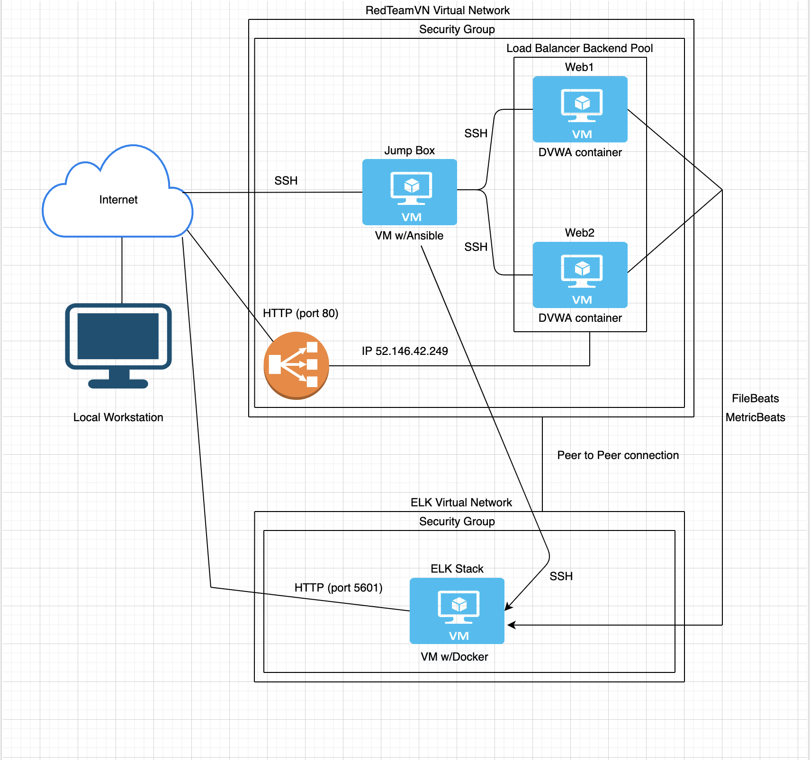

## Automated ELK Stack Deployment

The files in this repository were used to configure the network depicted below.

These files have been tested and used to generate a live ELK deployment on Azure. They can be used to either recreate the entire deployment pictured above. Alternatively, select portions of the YAML file may be used to install only certain pieces of it, such as Filebeat.

  - [install-ekl.yml](Ansible/install-ekl.yml)
  - [playbook.yml](Ansible/playbook.yml)
  - [filebeat-playbook.yml](Ansible/roles/filebeat-playbook.yml)
  - [metricbeat-playbook.yml](Ansible/roles/metricbeat-playbook.yml)
  - [filebeat config](Ansible/files/filebeat-playbook.yml)
  - [metricbeat config](Ansible/files/metricbeat-playbook.yml)
  - [hosts](Ansible/hosts)
  - [ansible.cfg](Ansible/ansible/cfg)

This document contains the following details:
- Description of the Topology
- Access Policies
- ELK Configuration
  - Beats in Use
  - Machines Being Monitored
- How to Use the Ansible Build

### Description of the Topology

The main purpose of this network is to expose a load-balanced and monitored instance of DVWA, the D*mn Vulnerable Web Application.

Load balancing ensures that the application will be highly available and reliable, in addition to restricting access to the network.
- Load balancers are not only managing traffic flow, but also protect servers from DDOS attacks.
The advantage of the jump box is that it provides a segregation layer between local infrastructure and the internet. With the jumb box in place there is no way of directly connecting to the application servers (backend pool).

Integrating an ELK server allows users to easily monitor the vulnerable VMs for changes to the logs and system traffic.
- Filebeat watches for log files/locations and collects log events.
- Metricbeat records metric and statistical data from the operating system and from services running on the server.

The configuration details of each machine may be found below.

| Name     | Function  | IP Address | Operating System |
|----------|-----------|------------|------------------|
| Jump Box | Gateway   | 10.0.0.4   | Linux            |
| Web1     | Backend   | 10.0.0.6   | Linux            |
| Web2     | Backend   | 10.0.0.5   | Linux            |
| ELK      | Analytics | 10.1.0.4   | Linux            |

### Access Policies

The machines on the internal network are not exposed to the public Internet. 

Only the Jump Box machine can accept connections from the Internet. Access to this machine is only allowed from the IP Address of my workstation.

Machines within the network can only be accessed by SSH.
- The only machine that is able to connect to ELK VM is Jump Box from private IP Address 10.0.0.4

A summary of the access policies in place can be found in the table below.

| Name     | Publicly Accessible | Allowed IP Addresses |
|----------|---------------------|----------------------|
| Jump Box | Yes                 | Workstation IP only  |
| Web1     | No                  | 10.0.0.4             |
| Web2     | No                  | 10.0.0.4             |
| ELK      | No                  | 10.0.0.4             |

### Elk Configuration

Ansible was used to automate configuration of the ELK machine. No configuration was performed manually, which is advantageous because it ensures consistancy and helps to save time.

The playbook implements the following tasks:
- Install docker engine
- Increase virtual memory for proper ELK stack work
- Dowload and launch ELK docker container
- Publish ports ELK stack runs on
- Start docker service on boot

The following screenshot displays the result of running `docker ps` after successfully configuring the ELK instance.

### Target Machines & Beats
This ELK server is configured to monitor the following machines:
- 10.0.0.5
- 10.0.0.6

We have installed the following Beats on these machines:
- Filebeat
- Metricbeat

These Beats allow us to collect the following information from each machine:
- Filebeat is a lightweight shipper for forwarding and centralizing log data. Filebeat monitors log files or locations you specify, collects log events, and forwards them either to Elasticsearch or Logstash for indexing.
- Metricbeat collects metrics from the operating system and from services running on the server. Metricbeat then takes the metrics and statistics that it collects and ships them to the output that you specify.

### Using the Playbook
In order to use the playbook, you will need to have an Ansible control node already configured. Assuming you have such a control node provisioned: 

SSH into the control node and follow the steps below:
- Copy the filebeat-config.yml and metricbeat-config.yml file to the /etc/ansible/roles/files/ directory.
- Update the configuration file to include the private IP of the ELK server to the ElasticSearch and Kibana sections of the configuration file.
- Run the playbook, and navigate to ELK server to check that the installation worked as expected.
- The ansible playbook file is called install-elk.yml
- To make Ansible run the playbook on a specific machine hosts file in ansible directory should be updated with the name of the machine and its IP address, the name of the machine should match the hosts key value in the playbook, so that Ansible can correctly map the playbook to the server.
- Navigate the following URL http://13.66.240.164:5601/ to check that the ELK sercer is running, where 13.66.240.164 is the public IP address of the ELK server.

The commands needed to run the Ansible configuration for the Elk-Server are:

- ssh azadmin@52.142.62.162
- sudo docker ps -a
- sudo docker start container (name of the container)
- sudo docker attach container (name of the container)
- cd /etc/ansible/
- ansible-playbook install-elk.yml
- cd /etc/ansible/roles/
- ansible-playbook filebeat-playbook.yml
- ansible-playbook metricbeat-playbook.yml
- navigate http://13.66.240.164:5601/

You will need to ensure all files are properly placed before running the ansible-playbooks.
